# PowerPoint Analyzer Agent 📊

A beginner-friendly agent built with **LangGraph** that extracts business intelligence from PowerPoint presentations and outputs structured data in CSV format for analysis.

## 🎯 Overview

This PowerPoint Analyzer is designed for business analysts who need to quickly extract and analyze customer information, deal outcomes, and business metrics from PowerPoint presentations.

**Author:** Abhijeet Kumar Sinha  
**Date:** October 24, 2025  
**Framework:** LangGraph with Azure OpenAI

---

## 🔄 High-Level Workflow

```mermaid
graph TD
    A[📁 Input: PowerPoint Folder] --> B[🔍 Extract Text from All Slides]
    B --> C[📝 Comprehensive Content Analysis]
    C --> D[🤖 AI Analysis with Azure OpenAI]
    D --> E[📋 Parse Structured Data]
    E --> F[📊 Generate CSV Output]
    F --> G[📄 Save Comprehensive Analysis]
    
    style A fill:#e1f5fe
    style F fill:#c8e6c9
    style G fill:#fff3e0
```



### **Node 1: Text Extraction** 🔍
- **Discovers** all PowerPoint files (.pptx, .ppt) in specified folder
- **Extracts** comprehensive text from every slide element:
  - Text boxes and shapes
  - Tables (headers and all rows)
  - Charts and embedded content
  - Headers and footers
- **Organizes** content with slide-by-slide structure
- **Filters** out temporary files (~$ files)
- **Handles** errors gracefully (corrupted/locked files)

### **Node 2: AI Analysis** 🤖
- **Analyzes** all extracted content using Azure OpenAI (GPT-4)
- **Identifies** customers using advanced detection strategies:
  - Direct mentions and indirect references
  - Email domains and meeting participants
  - Industry context and company indicators
  - Cross-slide correlation of customer data
- **Extracts** business metrics:
  - Customer names and products
  - Deal outcomes (Won/Lost)
  - Revenue opportunities and seat counts
  - Win/loss rationales
- **Ensures** consistency with retry logic and validation

### **Node 3: CSV Generation** 📊
- **Parses** AI output into structured data
- **Validates** and enhances missing fields
- **Generates** Excel-compatible CSV with UTF-8 encoding
- **Creates** comprehensive analysis text file for detailed review

---

## 🚀 Getting Started

### **Prerequisites**
```bash
pip install langgraph langchain-openai python-pptx pandas python-dotenv
```

### **Environment Setup**
Create a `.env` file with your Azure OpenAI credentials:
```env
AZURE_OPENAI_API_KEY=your_api_key_here
AZURE_OPENAI_ENDPOINT=your_endpoint_here
AZURE_OPENAI_CHAT_MODEL=your_model_name
AZURE_OPENAI_API_VERSION=2024-02-01
```

### **Usage Options**

#### **1. Interactive Mode (Beginner-Friendly)**
```bash
python ppt_analyzer.py
```
- Prompts for folder path
- Shows default options
- Provides real-time feedback

#### **2. Command Line Mode (Automation)**
```bash
python ppt_analyzer.py "C:\path\to\your\powerpoint\files"
```
- Direct folder specification
- Perfect for scripts and automation

#### **3. Programmatic Mode (Integration)**
```python
from ppt_analyzer import run_ppt_analyzer
run_ppt_analyzer("C:\path\to\your\powerpoint\files")
```

---

## 📊 Output Structure

### **CSV File (`output/ppt_analysis.csv`)**
| Column | Description | Example |
|--------|-------------|---------|
| `customer` | Company/organization name | "Contoso" |
| `product` | Product or service | "Foo bar" |
| `won_or_lost` | Deal outcome | "Won" or "Lost" |
| `revenue_opportunity` | Financial value | "$2.4M" |
| `seats` | Number of licenses/users | "12000" |
| `why_we_won_or_lost` | Win/loss rationale | "Superior security features" |
| `source_file` | Source PowerPoint file | "Q4_Review.pptx" |

### **Comprehensive Analysis (`output/comprehensive_analysis.txt`)**
- Complete AI analysis with detailed insights
- Full customer context and business intelligence
- Detailed reasoning and additional observations
- Metadata about analysis quality and customer count

---

## 🔧 Key Features

### **🎯 Advanced Customer Detection**
- **Multi-context identification**: Finds customers in headers, tables, email signatures, meeting notes
- **Cross-slide correlation**: Connects partial customer information across multiple slides
- **Industry context recognition**: Identifies customers through business vertical clues
- **Complete name resolution**: Uses full legal names when available

### **🔄 Consistency & Reliability**
- **Deterministic AI settings**: `temperature=0` and fixed seed for reproducible results
- **Retry logic**: Multiple analysis attempts to ensure completeness
- **Best result selection**: Chooses analysis with highest customer detection count
- **Content validation**: Hash-based verification for consistency tracking

### **📈 Business Intelligence Focus**
- **CVP-optimized**: Specifically designed for customer value partner workflows
- **Deal outcome tracking**: Structured win/loss analysis with rationales
- **Revenue intelligence**: Financial opportunity extraction and seat count analysis
- **Source traceability**: Links all data back to specific PowerPoint files

### **🛡️ Error Handling & Security**
- **Graceful degradation**: Handles corrupted, locked, or password-protected files
- **Secure credentials**: Uses environment variables (no hardcoded secrets)
- **Generic paths**: Cross-platform compatibility with user-agnostic defaults
- **Comprehensive logging**: Detailed feedback and debugging information

---

## 🔍 How It Works Under the Hood

### **LangGraph Workflow Architecture**
```python
StateGraph(PPTAnalysisState)
├── extract_text_node     # Text extraction from PowerPoint files
├── analyze_content_node  # AI-powered business analysis
└── generate_csv_node     # Structured data output generation
```

### **State Management**
The workflow maintains state through a `PPTAnalysisState` TypedDict:
- `ppt_folder`: Input folder path
- `ppt_files`: List of discovered PowerPoint files
- `all_extracted_text`: Combined text from all presentations
- `structured_data`: Parsed business records
- `output_file`: Generated CSV file path

### **AI Prompt Engineering**
- **Systematic analysis instructions**: Ensures thorough slide-by-slide review
- **Format compliance**: Strict output format for reliable parsing
- **Consistency requirements**: Multiple quality checks and completeness verification
- **Business context awareness**: CVP-specific terminology and metrics focus

---

## 📁 File Structure
```
├── ppt_analyzer.py           # Main analyzer script
├── output/
│   ├── ppt_analysis.csv      # Structured business data
│   └── comprehensive_analysis.txt  # Detailed AI analysis
├── .env                      # Azure OpenAI credentials (not included)
└── README_PPT_Analyzer.md    # This documentation
```

---

## 🎯 Use Cases

### **Execs**
- Analyze quarterly business reviews
- Extract deal outcomes and win/loss reasons
- Generate structured data for CRM updates
- Create executive summaries from presentation data

### **Sales Teams**
- Track competitive wins and losses
- Analyze revenue opportunities across accounts
- Extract customer feedback and objections
- Generate pipeline reports from presentation data

### **Business Analysts**
- Convert unstructured presentation data to structured datasets
- Perform trend analysis on customer interactions
- Generate insights from historical presentation archives
- Create data-driven reports for stakeholders

---

## 🤝 Contributing

This is a beginner-friendly project designed to demonstrate:
- LangGraph workflow implementation
- Business document analysis with AI
- Structured data extraction patterns
- Enterprise-ready error handling

Feel free to extend the functionality for your specific business needs!

---

## 📜 License

This project is part of a learning repository focused on AI agent development and business process automation.

---

## 🔗 Related Technologies

- **[LangGraph](https://langchain-ai.github.io/langgraph/)**: Workflow orchestration
- **[Azure OpenAI](https://azure.microsoft.com/products/ai-services/openai-service)**: AI analysis engine
- **[python-pptx](https://python-pptx.readthedocs.io/)**: PowerPoint file processing
- **[pandas](https://pandas.pydata.org/)**: Data manipulation and CSV generation

---

*Built with ❤️ for business intelligence and customer value analysis*